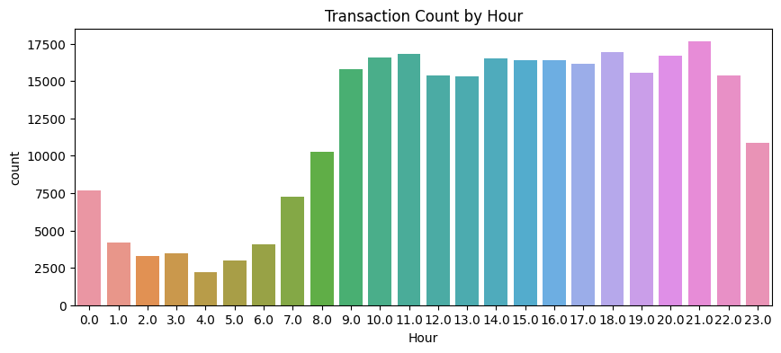
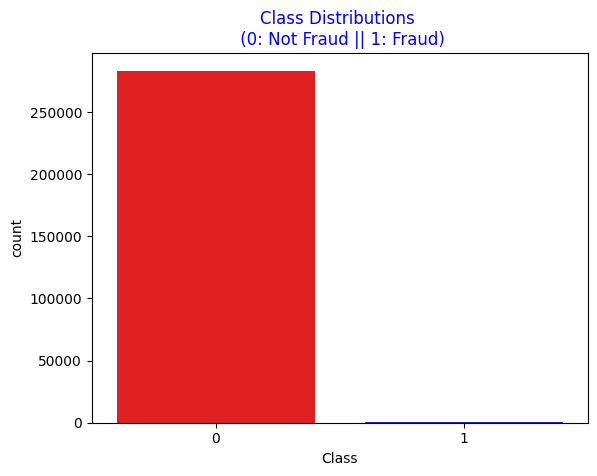

# Credit Card Fraud Detection Project

## Introduction
Credit card fraud represents a major risk to both financial institutions and consumers, causing significant financial losses annually. Detecting fraudulent transactions accurately is essential to reducing these losses and preserving trust in financial systems. This project is focused on developing a machine learning model that can identify fraudulent credit card transactions effectively. The dataset used for this project is provided by Kaggle, offering a foundation for data analysis and model building.

## Dataset Overview
The dataset features credit card transactions made by European cardholders over a two-day period in September 2013. It contains 284,807 transactions, of which only 492 are fraudulent—approximately 0.172% of the data. This notable class imbalance presents challenges during model training and evaluation, requiring careful attention to ensure fair and reliable model performance.

## Feature Description
**Time**: The time elapsed in seconds between each transaction and the first transaction in the dataset.

**V1** to **V28**: Principal components derived from a PCA transformation applied to the original features, anonymized for privacy reasons.

**Amount**: The transaction amount, which can provide insights and be utilized for cost-sensitive learning.

**Class**: The target variable, where 1 indicates a fraudulent transaction, and 0 indicates a legitimate transaction.

## Data Preprocessing
Effective preprocessing is essential to address the class imbalance and prepare the data for modeling. The following steps were undertaken:

### Loading the Data

The dataset was loaded using Pandas:

1. > **import pandas as pd**: The initial step involves loading the credit card transaction dataset from a CSV file into a pandas DataFrame named data1. The pd.read_csv() function is utilized for this purpose, reading the data from the specified file path '../raw_data/creditcard.csv'.

```python
data1 = pd.read_csv('../raw_data/creditcard.csv')
```
2. > **Verifying the absence of missing values to ensure data integrity.**:

```python
### **Data Integrity Check: Missing Values**

df.isnull().sum().sum()
```

>> - Verifying the absence of missing values to ensure data integrity.
After loading and initially inspecting the data, it's crucial to check for missing values. The code above utilizes the pandas isnull() and sum() methods to determine the total number of missing values within the DataFrame df.
>> - Specifically, df.isnull() creates a boolean mask indicating the presence of missing values (True) or their absence (False) for each element in the DataFrame. Then, .sum() is applied twice: first to sum the boolean values along each column (resulting in the count of missing values per column), and then a second time to sum those column-wise sums, yielding the grand total of missing values in the entire DataFrame.
>> - The result of this operation was 0. This 0 indicates that there are no missing values present in the DataFrame df. This is a critical verification step, as missing values can significantly impact the performance of machine learning models. Therefore, confirming the absence of missing data is a fundamental prerequisite for reliable model training and evaluation.

3. > **Identifying and removing duplicate entries to improve data quality**:
>> - This code snippet focuses on identifying and quantifying duplicate rows within the DataFrame df. The pandas duplicated() method returns a boolean Series indicating whether each row is a duplicate of a previous row. The .sum() method then counts the number of True values, effectively giving the total number of duplicate rows.

### **Data Cleaning: Duplicate Row Removal**

```python
duplicate_rows = df.duplicated().sum()
print(f"Number of duplicate rows: {duplicate_rows}")

#output
# Number of duplicate rows: 1081
```

>> - The output Number of duplicate rows: 1081 indicates that the original DataFrame contained 1081 duplicate rows. These duplicates can introduce bias and redundancy into the dataset, potentially affecting the performance of subsequent analysis and modeling.

>> - Following the identification of duplicate rows, the drop_duplicates() method is used to remove these entries from the DataFrame df. The reset_index(drop=True) command re-indexes the DataFrame after the removal, ensuring a contiguous index and dropping the old index.

```python
df = df.drop_duplicates().reset_index(drop=True)
duplicate_rows = df.duplicated().sum()
print(f"Number of duplicate rows: {duplicate_rows}")

#output
# Number of duplicate rows: 0
```
>> - The subsequent output Number of duplicate rows: 0 confirms that the duplicate rows have been successfully removed, leaving a clean dataset for further preprocessing and analysis. The fact that the first print statement saved the initial number of duplicates and the second print showed 0, validates the success of the removal.

4. > **Converting time-based data into cyclical features to capture temporal patterns**:
>> - This code segment focuses on transforming the 'Time' feature, which represents the seconds elapsed since the first transaction, into a more meaningful 'Hour' feature and then applying a cyclical transformation.

### **Feature Engineering: Cyclical Transformation of Time**

```python
df['Hour'] = (df['Time'] // 3600) % 24

df["Hour_sin"] = np.sin(2 * np.pi * df["Hour"] / 24)
df["Hour_cos"] = np.cos(2 * np.pi * df["Hour"] / 24)

# Plot the number of transactions by Hour
plt.figure(figsize=(10, 4))
sns.countplot(x=df['Hour'])
plt.title("Transaction Count by Hour")
plt.show()

df.drop(columns=["Hour"], inplace=True)
```

>> - First, df['Hour'] = (df['Time'] // 3600) % 24 calculates the hour of the day from the 'Time' feature. The // operator performs integer division to get the number of hours, and % 24 ensures the hour wraps around to 0 after 23, effectively representing the 24-hour clock.
>> -Next, df["Hour_sin"] = np.sin(2 * np.pi * df["Hour"] / 24) and df["Hour_cos"] = np.cos(2 * np.pi * df["Hour"] / 24) apply a cyclical transformation using sine and cosine functions. This transformation is crucial for machine learning models to understand the cyclical nature of time (e.g., 23:00 is closer to 00:00 than to 12:00).
>> - A count plot is then generated using seaborn to visualize the distribution of transactions across different hours of the day. This plot helps to understand the transaction patterns and potential time-based trends in the data.
>> - Finally, df.drop(columns=["Hour"], inplace=True) removes the original 'Hour' feature, as its cyclical representation (Hour_sin and Hour_cos) now captures the relevant temporal information.
>> - This cyclical transformation allows the model to properly understand the relationship between time and fraudulent transactions, as it encodes the proximity of the ends of the day.



5. > **Examining the distribution of the target variable to understand class imbalance**:
>> - Next step snippet calculates and displays the count of each unique value in the 'Class' column of the DataFrame df. The 'Class' column represents the target variable, where 0 indicates a non-fraudulent transaction and 1 indicates a fraudulent transaction.
>> -

```python
df["Class"].value_counts()

#output
# 0    283253
#1       473
#Name: Class, dtype: int64
```

>> - The output shows that there are 283,253 non-fraudulent transactions and 473 fraudulent transactions in the dataset. This immediately highlights the significant class imbalance, where the majority of transactions are non-fraudulent.

```python
print('Not Fraud', round(df['Class'].value_counts()[0]/len(df) * 100,2))
print('Fraud', round(df['Class'].value_counts()[1]/len(df) * 100,2))

#output
# Not Fraud 99.83
#Fraud 0.17
```
>> - The output confirms that 99.83% of the transactions are non-fraudulent, while only 0.17% are fraudulent, reinforcing the severe class imbalance.

```python
sns.countplot('Class', data=df, palette=["red","blue"])
plt.title('Class Distributions \n (0: Not Fraud || 1: Fraud)', fontsize=12, color="Blue")
```
>> - This part of the code generates a count plot using seaborn to visually represent the distribution of the 'Class' variable.
sns.countplot('Class', data=df, palette=["red","blue"]) creates the count plot, with red representing non-fraudulent transactions (0) and blue representing fraudulent transactions (1).



6. > **Data Preparation: Feature and Target Separation and Train-Test Split**:
>> - Following the analysis of the class distribution, the dataset is prepared for machine learning model training. The first step involves separating the features (independent variables) and the target variable (dependent variable).

```python
X = df.drop("Class", axis=1)
y = df["Class"]

X_train, X_test, y_train, y_test = train_test_split(X, y, test_size=0.2, random_state=42, stratify=y)
```
>> - Following the analysis of the class distribution, the dataset is prepared for machine learning model training. The first step involves separating the features (independent variables) and the target variable (dependent variable).
>> - X = df.drop("Class", axis=1) creates the feature matrix X by dropping the 'Class' column from the DataFrame df. This ensures that X contains only the input features used for prediction.
>> - y = df["Class"] creates the target vector y by selecting the 'Class' column, which contains the labels indicating whether a transaction is fraudulent or not.
>> - Next, X_train, X_test, y_train, y_test = train_test_split(X, y, test_size=0.2, random_state=42, stratify=y) splits the data into training and testing sets. The train_test_split function from scikit-learn is used for this purpose.
>>> - test_size=0.2 specifies that 20% of the data should be used for testing, while the remaining 80% is used for training.
>>> - random_state=42 ensures reproducibility by fixing the random seed.
>>> - stratify=y is crucial for imbalanced datasets like this one. It ensures that the class distribution in the training and testing sets is the same as in the original dataset. This is vital to prevent the model from being trained on a training set that does not accurately represent the overall distribution of fraudulent and non-fraudulent transactions. This process creates X_train and y_train for training the model, and X_test and y_test for evaluating its performance.

7. > **Addressing Class Imbalance with Advanced Techniques**:

>> - One of the primary challenges when working with the Credit Card Fraud Detection dataset is the **highly imbalanced nature of the data**, where fraudulent transactions make up only 0.172% of the total. This imbalance can lead machine learning models to favor the majority class, resulting in poor performance when identifying fraudulent transactions. Such bias is harmful because failing to detect fraud accurately can lead to significant financial losses and damage to consumer trust. It also highlights the importance of employing strategies to rebalance the data, ensuring the model's fairness and reliability.

>> - Imbalanced datasets cause a disproportionate influence of the majority class during model training. This results in:
>>> - A high number of false negatives (failing to detect fraudulent transactions).
>>> - Misleading accuracy scores, as the model might predict the majority class most of the time and still appear accurate.

### Introductory Information for the Code

>> - To address the challenge of data imbalance, the project utilizes **BorderlineSMOTE**, a variation of SMOTE (Synthetic Minority Oversampling Technique). BorderlineSMOTE focuses on generating synthetic samples near the decision boundary, where misclassification is more likely. This targeted approach strengthens the model's ability to distinguish fraudulent transactions effectively.

>> - In the provided code snippet:
>>> - **BorderlineSMOTE** is applied to rebalance the training dataset by generating synthetic samples for the minority class.
>>> - After applying BorderlineSMOTE, the distribution of the target variable (`y_train_smote`) is displayed, showing the impact of oversampling.

```python
# Apply BorderlineSMOTE (instead of regular SMOTE)
smote = BorderlineSMOTE(sampling_strategy=0.3, random_state=42)
X_train_smote, y_train_smote = smote.fit_resample(X_train, y_train)
print("\nClass distribution after SMOTE:\n", pd.Series(y_train_smote).value_counts())

#output
# Class distribution after SMOTE:
# 0    226602
# 1     67980
# Name: Class, dtype: int64
```

>> ### 🔍 Why Use BorderlineSMOTE & Tomek Links?

>> - Combining **BorderlineSMOTE** with **Tomek Links** provides a comprehensive approach to handling imbalanced data:
- **BorderlineSMOTE**:
  - Generates synthetic samples only near the decision boundary, improving robustness in distinguishing fraud from non-fraud cases.
  - Reduces the risk of overlapping classes, a common issue with regular SMOTE.
  - Works best in scenarios like this, where fraud cases are rare and lie close to the class boundary.
- **Tomek Links**:
  - Removes ambiguous samples that are close to the opposite class, further refining the dataset for better model performance.

This combined strategy ensures that the training data is both balanced and cleansed of noisy samples, resulting in a more accurate and reliable fraud detection model.


# Project Name
- Document your project here
- Description
- Data used
- Where your API can be accessed
- ...

# API
Document main API endpoints here

# Setup instructions
Document here for users who want to setup the package locally

# Usage
Document main functionalities of the package here


# installation

make install requirments
make run preprocess
