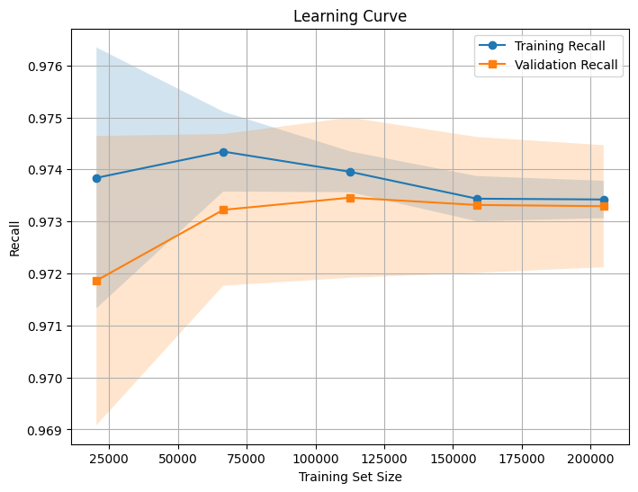
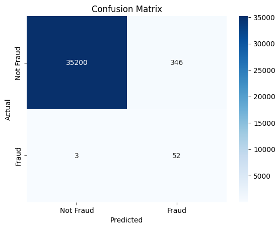

Model Training and Evaluation
To detect fraudulent transactions effectively, we employed two machine learning models: Logistic Regression and XGBoost. Given the severe class imbalance, special techniques were used to enhance model performance.

Logistic Regression
Logistic Regression is a simple yet powerful model for binary classification. To address the class imbalance, the class_weight="balanced" parameter was used, ensuring the minority class (fraudulent transactions) received appropriate weight. The model was trained with 1000 iterations for optimal convergence.

XGBoost Classifier
XGBoost is a high-performance gradient boosting algorithm known for its efficiency in handling imbalanced datasets. The scale_pos_weight parameter was used to balance fraud detection, and the binary:logistic objective was chosen for probability-based predictions.

Evaluation Metrics
Since fraud detection requires prioritizing correctly identifying fraudulent cases, we used:

Recall: Measures the percentage of fraudulent transactions correctly identified. Higher recall reduces false negatives.
Precision-Recall AUC (PR AUC): Evaluates model performance on imbalanced datasets, focusing on fraud detection rather than overall accuracy.
Results
Logistic Regression provided the best performance, achieving a high recall score while maintaining strong precision-recall balance. This indicates its effectiveness in detecting fraudulent transactions without excessive false positives.
Model Training and Evaluation
1. Logistic Regression
Logistic Regression is a simple yet effective algorithm for binary classification. In the credit card fraud detection task, the model was trained while considering the significant class imbalance.
Hyperparameter Optimization with RandomizedSearchCV
To improve model performance, we conducted a randomized search over a predefined parameter space using Recall as the scoring metric. This approach ensures that fraudulent transactions are correctly identified, which is crucial for fraud detection.

from sklearn.model_selection import RandomizedSearchCV
from sklearn.linear_model import LogisticRegression

# Defining parameter distribution
param_dist = {
    "C": [1, 10, 50],
    "class_weight": ["balanced"],
    "max_iter": [500, 1000, 2000]
}

# Initializing model
model = LogisticRegression()

# Running RandomizedSearchCV
random_search = RandomizedSearchCV(
    model, param_dist, n_iter=3, cv=2, scoring="recall", 
    random_state=42, n_jobs=-1, verbose=2
)

# Training with best parameters
random_search.fit(X_train_transformed, y_train)

# Best parameters
best_params = random_search.best_params_
print("Best Parameters:", best_params)
Best Model Parameters Found
After hyperparameter tuning, the optimal configuration was:

C=10 → Weak regularization, allowing better flexibility.
class_weight="balanced" → Adjusts for class imbalance automatically.
max_iter=1000 → Ensures sufficient iterations for convergence.
🚀 Note: The solver parameter was not explicitly set, as it did not improve the model's performance.

Optimal Model Parameters
C=10 → Weak regularization (allows for more model flexibility).
class_weight="balanced" → Automatically balances class weights to account for the rarity of fraudulent cases.
max_iter=1000 → Ensures convergence during optimization.
penalty="l2" → Ridge regularization helps prevent overfitting.
solver was not explicitly used, as it did not improve model performance.
Model Training
python
Copy
Edit
from sklearn.linear_model import LogisticRegression

# Initializing the model with optimal parameters
log_reg = LogisticRegression(C=10, class_weight='balanced', max_iter=1000)

# Training the model
log_reg.fit(X_train, y_train)
Model Performance
Metric	Value
Recall	0.9455
Precision	0.1300
F1-score	0.2286
ROC AUC	0.9941
PR AUC	0.7839
Analysis of Results
High Recall (94.55%) → The model effectively detects fraudulent transactions.
Low Precision (13.00%) → A significant number of false positives.
PR AUC = 0.7839 → Good ability to distinguish between fraudulent and non-fraudulent transactions.
ROC AUC = 0.9941 → Excellent class separation performance.
To further analyze the model's learning behavior, we examined the learning curve.

Impact of Removing Random BP Preposition
After modifying the preprocessing pipeline by removing random BP preposition, the model's performance metrics shifted:

Recall decreased from 0.9455 to 0.8955 → The model now misses more fraudulent cases.
Precision increased from 0.1300 to 0.1869 → Fewer false positives.
F1-score improved from 0.2286 to 0.3093 → A better balance between precision and recall.
ROC AUC slightly decreased from 0.9941 to 0.9886.
PR AUC decreased from 0.7839 to 0.7617.
Updated Model Performance
Metric	Before (With BP)	After (Without BP)
Recall	0.9455              	0.8955
Precision	0.1300	            0.1869
F1-score	0.2286	            0.3093
ROC AUC	0.9941	                0.9886
PR AUC	0.7839	                0.7617
Analysis of Results
Higher precision, lower recall suggests that the model is now more conservative in predicting fraud, reducing false positives but also increasing false negatives.
The decrease in PR AUC indicates a slight reduction in model effectiveness for imbalanced data.
Overall, the model is now more precise but detects fewer fraud cases.
Updated Model Training

best_model = LogisticRegression(C=10, class_weight="balanced", max_iter=1000)
best_model.fit(X_train, y_train)

2. Learning Curve Analysis
To analyze the effect of removing random BP preposition, we examined the learning curve.

📊 Key Observations:

The gap between Training and Validation Recall is slightly wider than before, suggesting that model generalization has changed.
Recall stabilizes at ~0.895, lower than before but with a gain in precision.
The overall model is now more balanced, prioritizing precision over recall.

Learning Curve Analysis
The learning curve shows how recall evolves with increasing training data:

Key Insights:
Recall stabilizes (~0.973) after 150,000 samples, meaning more data has minimal impact.
Gap between training and validation recall decreases, showing improved generalization.
Slight overfitting in smaller datasets, where training recall is higher.
Variance reduces with more data, making recall more consistent.

Confusion Matrix Analysis
TN: 35,200 → Correctly identified non-fraud.
FP: 346 → False fraud alerts.
FN: 3 → Missed fraud cases.
TP: 52 → Correctly detected fraud.