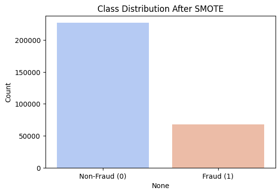
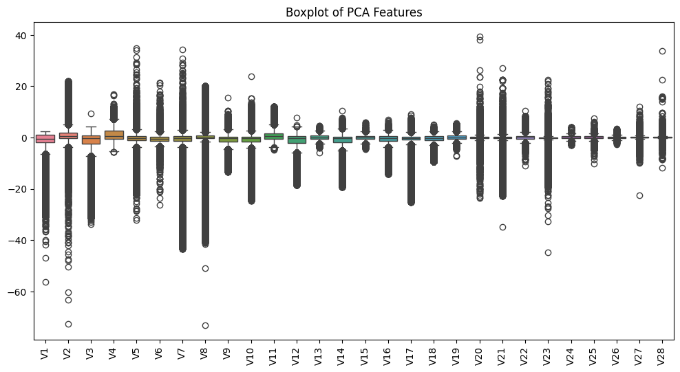
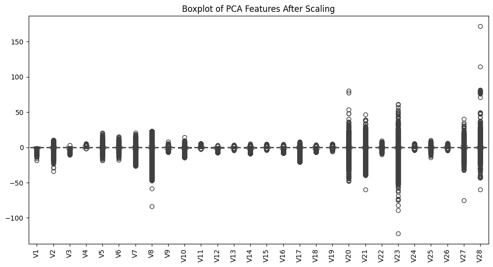
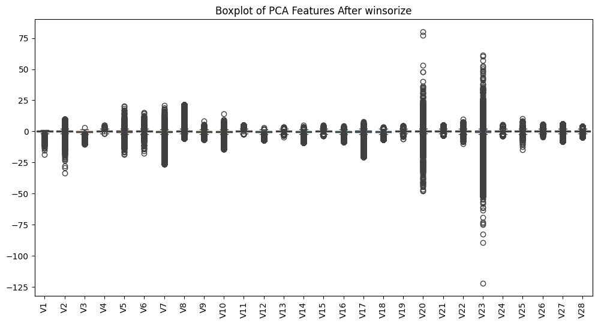
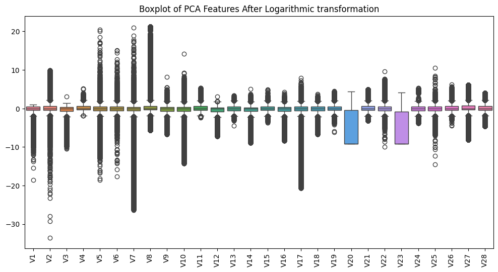
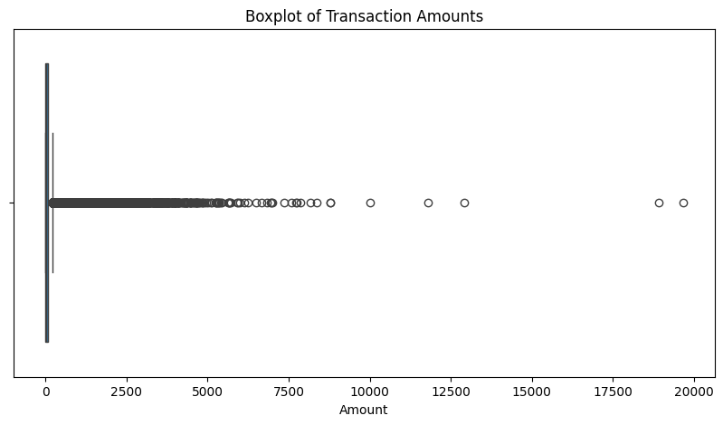
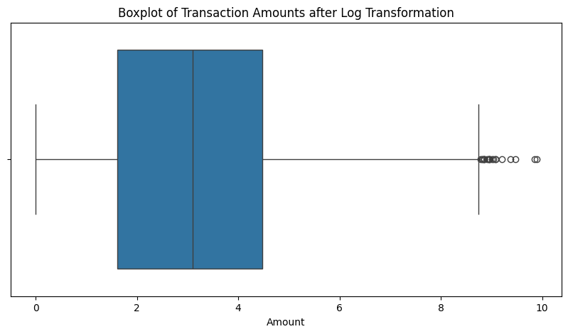
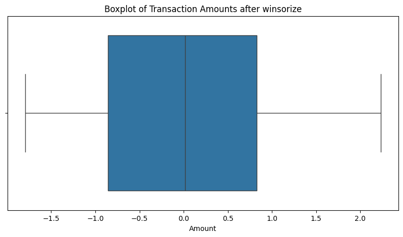

# Data Preprocessing
Effective preprocessing is essential to address the class imbalance and prepare the data for modeling. The following steps were undertaken:

## Dataset Overview
The dataset features credit card transactions made by European cardholders over a two-day period in September 2013. It contains 284,807 transactions, of which only 492 are fraudulent—approximately 0.172% of the data. This notable class imbalance presents challenges during model training and evaluation, requiring careful attention to ensure fair and reliable model performance.

## Feature Description
**Time**: The time elapsed in seconds between each transaction and the first transaction in the dataset.<br>
**V1** to **V28**: Principal components derived from a PCA transformation applied to the original features, anonymized for privacy reasons.<br>
**Amount**: The transaction amount, which can provide insights and be utilized for cost-sensitive learning.<br>
**Class**: The target variable, where 1 indicates a fraudulent transaction, and 0 indicates a legitimate transaction.<br>

## Loading the Data and manipulating the dataset

### **1. import pandas as pd**:
The initial step involves loading the credit card transaction dataset from a CSV file into a pandas DataFrame named data1. The pd.read_csv() function is utilized for this purpose, reading the data from the specified file path '../raw_data/creditcard.csv'.

```python
data1 = pd.read_csv('../raw_data/creditcard.csv')
```
### **2. Verifying the absence of missing values to ensure data integrity.**:

```python
### **Data Integrity Check: Missing Values**

df.isnull().sum().sum()
```

>> - Verifying the absence of missing values to ensure data integrity.
After loading and initially inspecting the data, it's crucial to check for missing values. The code above utilizes the pandas isnull() and sum() methods to determine the total number of missing values within the DataFrame df.
>> - Specifically, df.isnull() creates a boolean mask indicating the presence of missing values (True) or their absence (False) for each element in the DataFrame. Then, .sum() is applied twice: first to sum the boolean values along each column (resulting in the count of missing values per column), and then a second time to sum those column-wise sums, yielding the grand total of missing values in the entire DataFrame.
>> - The result of this operation was 0. This 0 indicates that there are no missing values present in the DataFrame df. This is a critical verification step, as missing values can significantly impact the performance of machine learning models. Therefore, confirming the absence of missing data is a fundamental prerequisite for reliable model training and evaluation.

### **3. Identifying and removing duplicate entries to improve data quality**:
>> - This code snippet focuses on identifying and quantifying duplicate rows within the DataFrame df. The pandas duplicated() method returns a boolean Series indicating whether each row is a duplicate of a previous row. The .sum() method then counts the number of True values, effectively giving the total number of duplicate rows.

#### **Data Cleaning: Duplicate Row Removal**

```python
duplicate_rows = df.duplicated().sum()
print(f"Number of duplicate rows: {duplicate_rows}")

#output
# Number of duplicate rows: 1081
```

>> - The output Number of duplicate rows: 1081 indicates that the original DataFrame contained 1081 duplicate rows. These duplicates can introduce bias and redundancy into the dataset, potentially affecting the performance of subsequent analysis and modeling.

>> - Following the identification of duplicate rows, the drop_duplicates() method is used to remove these entries from the DataFrame df. The reset_index(drop=True) command re-indexes the DataFrame after the removal, ensuring a contiguous index and dropping the old index.

```python
df = df.drop_duplicates().reset_index(drop=True)
duplicate_rows = df.duplicated().sum()
print(f"Number of duplicate rows: {duplicate_rows}")

#output
# Number of duplicate rows: 0
```
>> - The subsequent output Number of duplicate rows: 0 confirms that the duplicate rows have been successfully removed, leaving a clean dataset for further preprocessing and analysis. The fact that the first print statement saved the initial number of duplicates and the second print showed 0, validates the success of the removal.

### **4. Converting time-based data into cyclical features to capture temporal patterns**:
>> - This code segment focuses on transforming the 'Time' feature, which represents the seconds elapsed since the first transaction, into a more meaningful 'Hour' feature and then applying a cyclical transformation.

#### **Feature Engineering: Cyclical Transformation of Time**

```python
df['Hour'] = (df['Time'] // 3600) % 24

df["Hour_sin"] = np.sin(2 * np.pi * df["Hour"] / 24)
df["Hour_cos"] = np.cos(2 * np.pi * df["Hour"] / 24)

# Plot the number of transactions by Hour
plt.figure(figsize=(10, 4))
sns.countplot(x=df['Hour'])
plt.title("Transaction Count by Hour")
plt.show()

df.drop(columns=["Hour"], inplace=True)
```

>> - First, df['Hour'] = (df['Time'] // 3600) % 24 calculates the hour of the day from the 'Time' feature. The // operator performs integer division to get the number of hours, and % 24 ensures the hour wraps around to 0 after 23, effectively representing the 24-hour clock.
>> -Next, df["Hour_sin"] = np.sin(2 * np.pi * df["Hour"] / 24) and df["Hour_cos"] = np.cos(2 * np.pi * df["Hour"] / 24) apply a cyclical transformation using sine and cosine functions. This transformation is crucial for machine learning models to understand the cyclical nature of time (e.g., 23:00 is closer to 00:00 than to 12:00).
>> - A count plot is then generated using seaborn to visualize the distribution of transactions across different hours of the day. This plot helps to understand the transaction patterns and potential time-based trends in the data.
>> - Finally, df.drop(columns=["Hour"], inplace=True) removes the original 'Hour' feature, as its cyclical representation (Hour_sin and Hour_cos) now captures the relevant temporal information.
>> - This cyclical transformation allows the model to properly understand the relationship between time and fraudulent transactions, as it encodes the proximity of the ends of the day.


### **5. Examining the distribution of the target variable to understand class imbalance**:
>> - Next step snippet calculates and displays the count of each unique value in the 'Class' column of the DataFrame df. The 'Class' column represents the target variable, where 0 indicates a non-fraudulent transaction and 1 indicates a fraudulent transaction.
>> -

```python
df["Class"].value_counts()

#output
# 0    283253
#1       473
#Name: Class, dtype: int64
```

>> - The output shows that there are 283,253 non-fraudulent transactions and 473 fraudulent transactions in the dataset. This immediately highlights the significant class imbalance, where the majority of transactions are non-fraudulent.

```python
print('Not Fraud', round(df['Class'].value_counts()[0]/len(df) * 100,2))
print('Fraud', round(df['Class'].value_counts()[1]/len(df) * 100,2))

#output
# Not Fraud 99.83
#Fraud 0.17
```
>> - The output confirms that 99.83% of the transactions are non-fraudulent, while only 0.17% are fraudulent, reinforcing the severe class imbalance.

```python
sns.countplot('Class', data=df, palette=["red","blue"])
plt.title('Class Distributions \n (0: Not Fraud || 1: Fraud)', fontsize=12, color="Blue")
```
>> - This part of the code generates a count plot using seaborn to visually represent the distribution of the 'Class' variable.
sns.countplot('Class', data=df, palette=["red","blue"]) creates the count plot, with red representing non-fraudulent transactions (0) and blue representing fraudulent transactions (1).


### **6. Data Preparation: Feature and Target Separation and Train-Test Split**:
>> - Following the analysis of the class distribution, the dataset is prepared for machine learning model training. The first step involves separating the features (independent variables) and the target variable (dependent variable).

```python
X = df.drop("Class", axis=1)
y = df["Class"]

X_train, X_test, y_train, y_test = train_test_split(X, y, test_size=0.2, random_state=42, stratify=y)
```
>> - Following the analysis of the class distribution, the dataset is prepared for machine learning model training. The first step involves separating the features (independent variables) and the target variable (dependent variable).
>> - X = df.drop("Class", axis=1) creates the feature matrix X by dropping the 'Class' column from the DataFrame df. This ensures that X contains only the input features used for prediction.
>> - y = df["Class"] creates the target vector y by selecting the 'Class' column, which contains the labels indicating whether a transaction is fraudulent or not.
>> - Next, X_train, X_test, y_train, y_test = train_test_split(X, y, test_size=0.2, random_state=42, stratify=y) splits the data into training and testing sets. The train_test_split function from scikit-learn is used for this purpose.
>>> - test_size=0.2 specifies that 20% of the data should be used for testing, while the remaining 80% is used for training.
>>> - random_state=42 ensures reproducibility by fixing the random seed.
>>> - stratify=y is crucial for imbalanced datasets like this one. It ensures that the class distribution in the training and testing sets is the same as in the original dataset. This is vital to prevent the model from being trained on a training set that does not accurately represent the overall distribution of fraudulent and non-fraudulent transactions. This process creates X_train and y_train for training the model, and X_test and y_test for evaluating its performance.

### **7. Addressing Class Imbalance with Advanced Techniques**:

>> - One of the primary challenges when working with the Credit Card Fraud Detection dataset is the **highly imbalanced nature of the data**, where fraudulent transactions make up only 0.172% of the total. This imbalance can lead machine learning models to favor the majority class, resulting in poor performance when identifying fraudulent transactions. Such bias is harmful because failing to detect fraud accurately can lead to significant financial losses and damage to consumer trust. It also highlights the importance of employing strategies to rebalance the data, ensuring the model's fairness and reliability.

>> - Imbalanced datasets cause a disproportionate influence of the majority class during model training. This results in:
>>> - A high number of false negatives (failing to detect fraudulent transactions).
>>> - Misleading accuracy scores, as the model might predict the majority class most of the time and still appear accurate.

### Introductory Information for the Code

>> - To address the challenge of data imbalance, the project utilizes **BorderlineSMOTE**, a variation of SMOTE (Synthetic Minority Oversampling Technique). BorderlineSMOTE focuses on generating synthetic samples near the decision boundary, where misclassification is more likely. This targeted approach strengthens the model's ability to distinguish fraudulent transactions effectively.

>> - In the provided code snippet:
>>> - **BorderlineSMOTE** is applied to rebalance the training dataset by generating synthetic samples for the minority class.
>>> - After applying BorderlineSMOTE, the distribution of the target variable (`y_train_smote`) is displayed, showing the impact of oversampling.

```python
# Apply BorderlineSMOTE (instead of regular SMOTE)
smote = BorderlineSMOTE(sampling_strategy=0.3, random_state=42)
X_train_smote, y_train_smote = smote.fit_resample(X_train, y_train)
print("\nClass distribution after SMOTE:\n", pd.Series(y_train_smote).value_counts())

#output
# Class distribution after SMOTE:
# 0    226602
# 1     67980
# Name: Class, dtype: int64
```

>> #### 🔍 Why Use BorderlineSMOTE & Tomek Links?

>> - Combining **BorderlineSMOTE** with **Tomek Links** provides a comprehensive approach to handling imbalanced data:
- **BorderlineSMOTE**:
  - Generates synthetic samples only near the decision boundary, improving robustness in distinguishing fraud from non-fraud cases.
  - Reduces the risk of overlapping classes, a common issue with regular SMOTE.
  - Works best in scenarios like this, where fraud cases are rare and lie close to the class boundary.
- **Tomek Links**:
  - Removes ambiguous samples that are close to the opposite class, further refining the dataset for better model performance.

This combined strategy ensures that the training data is both balanced and cleansed of noisy samples, resulting in a more accurate and reliable fraud detection model.


### **8. Visualizing Class Distribution Post-SMOTE**

To gain further insights into the results of the oversampling process, it is crucial to visualize the class distribution after applying **BorderlineSMOTE**. Visualization provides an intuitive way to confirm the effects of oversampling and validate that the class imbalance has been significantly addressed. By plotting the counts of each class, we can ensure that the dataset is now more balanced, supporting better model performance during training.

The provided code snippet achieves this by:
1. **Plotting the Class Distribution**: Using Seaborn's barplot, the distribution of `y_train_smote` is displayed, with separate counts for the "Non-Fraud" (`0`) and "Fraud" (`1`) classes.
2. **Calculating Class Proportions**: The proportions of each class are computed and displayed as percentages, confirming that fraud cases now account for approximately **23.08%** of the training data, compared to the overwhelming dominance of non-fraud cases before SMOTE.

```python
# Plot new class distribution
plt.figure(figsize=(6, 4))
sns.barplot(x=pd.Series(y_train_smote).value_counts().index,
            y=pd.Series(y_train_smote).value_counts().values, palette="coolwarm")
plt.xticks(ticks=[0, 1], labels=["Non-Fraud (0)", "Fraud (1)"])
plt.ylabel("Count")
plt.title("Class Distribution After SMOTE")
plt.show()

print('Not Fraud', round(y_train_smote.value_counts()[0]/len(y_train_smote) * 100, 2))
print('Fraud', round(y_train_smote.value_counts()[1]/len(y_train_smote) * 100, 2))
```



**Output:**
```
Not Fraud: 76.92%
Fraud: 23.08%
```

The visualization clearly highlights the shift in class distribution, demonstrating the success of the rebalancing process. With a more equitable distribution of classes, the model is now better equipped to learn meaningful patterns for identifying fraudulent transactions without being biased toward the majority class. These improvements ultimately enhance the model's predictive capabilities, particularly in recognizing rare fraud cases.

This step is an essential part of evaluating the preprocessing workflow and ensures that the chosen oversampling technique has achieved its intended effect. Would you like me to add further explanatory notes about the visualization or suggest next steps in the workflow?

### **9.  Visualizing the distribution of PCA-transformed features to identify potential outliers:**

This code snippet generates a boxplot of the PCA-transformed features (V1-V28) in the training data after applying BorderlineSMOTE. The purpose is to visually inspect the distribution of these features and identify potential outliers.


```python
plt.figure(figsize=(12, 6))
sns.boxplot(data=X_train_smote.iloc[:, 1:29])  # Excluding 'Time', 'Amount', 'Hour', 'Class'
plt.xticks(rotation=90)
plt.title("Boxplot of PCA Features")
plt.show()
```



The resulting boxplot reveals the presence of outliers in several PCA features, which could potentially impact the performance of machine learning models.<br>
To address the issue of outliers, Robust Scaling is applied to the PCA-transformed features. This scaling technique is less sensitive to outliers compared to standard scaling.

The boxplot of the scaled features shows that the outliers have been mitigated, and the features are now on a more comparable scale. Robust Scaling helps to ensure that the model is not overly influenced by extreme values, leading to improved performance.



After scaling the PCA features to ensure uniformity in range and robustness against outliers, it's equally important to address extreme values that might still skew the analysis or model performance. In this step, we introduce the Winsorization process, which offers a robust technique to handle outliers by capping extreme values instead of outright removing them.

```python
columns_to_winsorize = ["V8", "V21", "V27", "V28"]

for col in columns_to_winsorize:
    X_train_smote[col] = winsorize(X_train_smote[col], limits=[0.01, 0.01])
```

The winsorize method, from the scipy.stats.mstats library, enables this transformation by limiting the proportion of extreme data points at both ends of the distribution. Here, specific PCA components—namely V8, V21, V27, and V28—have been selected for Winsorization due to their observed outlier behavior. By setting the limits at [0.01, 0.01], the method caps the bottom and top 1% of values, ensuring the underlying data distribution remains largely intact while mitigating the impact of extreme cases.

This adjustment aims to stabilize the dataset further, aligning it for reliable model training and validation.



During the preprocessing stage, dealing with negative values in features is a crucial step to ensure compatibility with transformations like logarithmic scaling. Logarithmic transformation is particularly useful for reducing skewness and stabilizing the variance in data, but it requires all input values to be non-negative.

```python
X_train_smote['V20'] = np.log(X_train_smote['V20'].clip(lower=0.0001))
X_train_smote['V23'] = np.log(X_train_smote['V23'].clip(lower=0.0001))
```

In this step, features V20 and V23, which contain negative values, are addressed by clipping them to a small positive threshold (0.0001). This ensures that all values in these columns become non-negative and suitable for logarithmic transformation. The transformed values are then applied to V20 and V23 using the natural logarithm function.

This adjustment not only resolves issues related to negative values but also enhances the distribution of these features, preparing them for subsequent analysis or modeling steps.



Also, as part of the data exploration process, it's critical to thoroughly examine the distribution of important features. The Amount feature, representing transaction amounts, is particularly significant for understanding patterns and potential anomalies in the dataset.

In this step, we utilize a boxplot and histogram to visualize the distribution of Amount values. The boxplot highlights the presence of numerous outliers, which can skew the data distribution and negatively impact the model’s performance. The histogram, enhanced with a kernel density estimate (KDE), provides a complementary view of the overall distribution, revealing insights into the data's shape and spread.

Identifying and addressing these outliers will be pivotal in subsequent preprocessing steps to ensure the reliability and effectiveness of the model.



To address the previously identified issue of outliers in the Amount feature, a transformation step is applied to improve the data's distribution and minimize the influence of extreme values. The log1p function is particularly effective in this context, as it applies a logarithmic transformation while handling zero values gracefully by adding 1 to each data point before taking the natural logarithm.

By transforming the Amount feature with log1p, the skewness of the distribution is reduced, resulting in a more normalized dataset. This preprocessing step further prepares the feature for use in the modeling process, ensuring that the model's performance is not adversely affected by the presence of large variances or outliers.



Building on the earlier steps to preprocess the Amount feature, we combine scaling and outlier handling to ensure this variable contributes effectively to the model. The following code applies these transformations sequentially:

```python
scaler = StandardScaler()
X_train_smote["Amount"] = scaler.fit_transform(X_train_smote[["Amount"]])
X_train_smote["Amount"] = winsorize(X_train_smote["Amount"], limits=[0.01, 0.01])
```
First, the Amount feature is standardized using the StandardScaler. This method centers the data by removing the mean and scales it to have a unit variance, ensuring that the feature is normalized and comparable across datasets.

Subsequently, the winsorize function is utilized to cap the extreme values in the Amount feature. By setting limits at 1% on both ends, it mitigates the impact of outliers while retaining as much of the dataset's original structure as possible. This step ensures that the transformed Amount feature remains robust and suitable for further analysis or modeling tasks.



After applying SMOTE to balance the dataset, it's essential to address potential noise caused by overlapping samples in the majority class. This step is crucial for refining the dataset and ensuring the model's ability to distinguish between fraud and non-fraud cases effectively.

The **Tomek Links** method is employed here for noise reduction. Tomek Links identifies and removes overlapping majority class samples that are in close proximity to minority class samples (fraud cases). This has the dual benefit of cleaning the dataset and sharpening the decision boundary, ultimately enhancing classification performance. However, it is important to note that removing too many majority class samples could weaken the model, particularly if the dataset is already balanced.

Here is the code for applying Tomek Links:

```python
tomek = TomekLinks()
X_final, y_final = tomek.fit_resample(X_train_pca, y_train_smote)
```

**When to use Tomek Links?**
- ✔ It is effective if a cleaner dataset is desired and the classifier is overfitting due to overlapping samples.
- ✔ It sharpens the decision boundary by eliminating overlapping majority class samples.

**When NOT to use Tomek Links?**
- ✖ Avoid it if the dataset is already well-balanced after applying SMOTE.
- ✖ If removing non-fraud samples reduces model performance, it may not be appropriate.

In this specific scenario, Tomek Links did not remove any samples, as no overlapping non-fraud cases were detected. This result suggests the application of Tomek Links was harmless and serves as a validation step to confirm dataset integrity.
